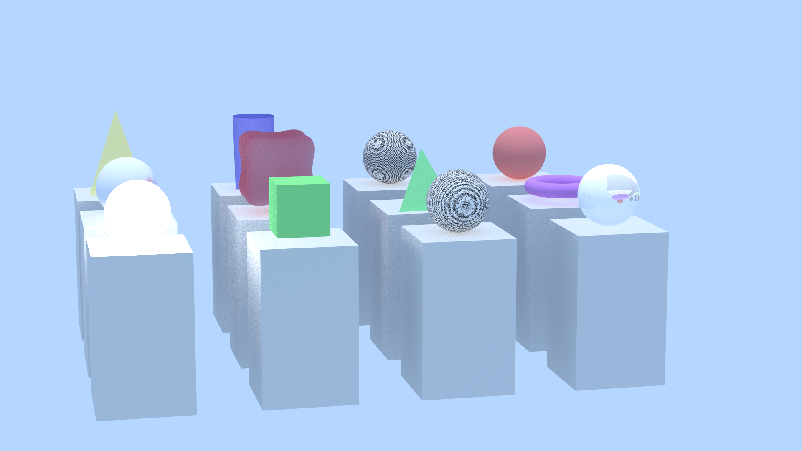

# Raytracer



## Table of contents 📑
- [Description](https://github.com/toro-nicolas/raytracer/blob/main/README.md#description-)
- [Usage](https://github.com/toro-nicolas/raytracer/blob/main/README.md#usage-%EF%B8%8F)
- [Result](https://github.com/toro-nicolas/raytracer/blob/main/README.md#result-)
- [Compilation](https://github.com/toro-nicolas/raytracer/blob/main/README.md#compilation-%EF%B8%8F)
- [Documentation](https://github.com/toro-nicolas/raytracer/blob/main/README.md#documentation-)
- [Code mandatory](https://github.com/toro-nicolas/raytracer/blob/main/README.md#code-mandatory-)
- [Contributors](https://github.com/toro-nicolas/raytracer/blob/main/README.md#contributors-)


## Description 📝
The **Raytracer** is a project carried out by **groups of 4** (see [Contributors](https://github.com/toro-nicolas/Raytracer/blob/main/README.md#contributors-), during our **2nd year** in [**EPITECH**](https://www.epitech.eu/) Grand Ecole program.  
Its purpose is to recreate in [**C++**](https://en.wikipedia.org/wiki/C%2B%2B) a **Raytracer**.
The Raytracer is a **3D scene** generator that uses the **Raytracing** technique to create realistic images.
It use a scene file to load the scene and generate the image.


## Usage ⚔️
You can run Raytracer like this :
```sh
./raytracer [scene_file]
```
For more information, please see the help section.
```sh
> ./raytracer --help
USAGE:
        ./raytracer <scene_file> [options]
DESCRIPTION:
        The raytracer generates a 3D scene based on the provided scene file.
        <scene_file>            The scene file to load
OPTIONS:
        -h, --help              Display this help message
        -v, --version           Display the version of the program
        -o, --output <file>     Specify the output file path
        -c, --config <file>     Specify the configuration file path
```

The Raytracer is designed to be **modular** and **extendable**.  
It uses **plugins** to load different types of **interfaces**, **lights**, **materials**, **primitives**, **scene loaders** and **transformation**.  
You are free to create your own plugins and add them to the Raytracer while respecting the plugins rules (see the [Documentation](https://github.com/toro-nicolas/Raytracer/blob/main/README.md#documentation-)).  
The Raytracer will use the **config.txt** file to load the plugins and parameters the Raytracer needs.  
Config file example:
```ini
#The folder where plugins are stored
plugin_folder=plugins

#The plugin to load scene
scene_loader=raytracer_scene_loader_libconfig.so

#The plugin for the raytracer interface
interface=raytracer_interface_sfml.so

#The folder to store the raytracer screenshots
screenshots_folder=screenshots
```


## Result 🚩
The result of this project is an **almost perfect Raytracer**.  
If you discover a **problem** or an **error**, don't hesitate to **create an issue** and **report it** to us as soon as possible.


### my.epitech.eu result
| Test name                   |  Result  | Crash  |
|-----------------------------|:--------:|:------:|
| Build via Makefile or CMake |    OK    |   No   |
| **Results**                 | **100%** | **No** |

### Defense
TODO


## Compilation 🛠️
This project is compiled with **CMake** and **Makefile**.  
This project use **C++20** standard, **CMake 3.20** or higher and **libconfig++**.

You can compile the project with this command :
- via CMake and Makefile :
```sh
cmake -B build -S . && make -s -C build -j
```

If you want to debug the program, you can compile the project with this :
- via CMake and Makefile :
```sh
cmake -B build -S . -DDEBUG_MODE=ON && make -s -C build -j
```

If you want clean the project, you can run this command :
- via CMake and Makefile :
```sh
cmake -B build -S . && make clean_all -s -C build -j
```


## Documentation 📚
For plugins, you can find the documentation for each plugin in the `docs` folder.
- The **scene file** documentation is accessible [here](docs/scene-file-documentation.md)
- The **interface** documentation is accessible [here](docs/interface-plugin-documentation.md)
- The **light** documentation is accessible [here](docs/light-plugin-documentation.md)
- The **material** documentation is accessible [here](docs/material-plugin-documentation.md)
- The **primitive** documentation is accessible [here](docs/primitive-plugin-documentation.md)
- The **scene loader** documentation is accessible [here](docs/scene-loader-plugin-documentation.md)
- The **transformation** documentation is accessible [here](docs/transformation-plugin-documentation.md)

The **code** documentation is accessible [here](https://toro-nicolas.github.io/Raytracer/html/).  

You can generate the documentation with this command :
- via CMake and Makefile:
```sh
cmake -B build -S . && make doc -s -C build -j
```
You need multiple package for generate them :
- doxygen
- doxygen-latex
- doxygen-doxywizard
- graphviz


## Code mandatory 📦
- You'll need to create a branch where you'll push your code. Once you've completed your tasks on this branch, we'll work together to merge it and check that everything works.
- Every function you add must be code-style and documented.
- If the github actions don't succeed, then ask yourself some questions
- Each commit will contain ```[+]``` or ```[-]``` or ```[~]``` followed by a message
    - ```[+]``` : Add feature
    - ```[-]``` : Delete feature
    - ```[~]``` : Edit feature

**Of course, in exceptional cases, we may depart from these rules.**


## Contributors 👥
For this project, we were a group of **4 people**. Here are the people in the group:
- [Gianni TUERO](https://github.com/xJundo)
- [Lou PELLEGRINO](https://github.com/DimitriLaPoudre)
- [Nicolas TORO](https://github.com/toro-nicolas)
- [Olivier POUECH](https://github.com/Livoooo)
